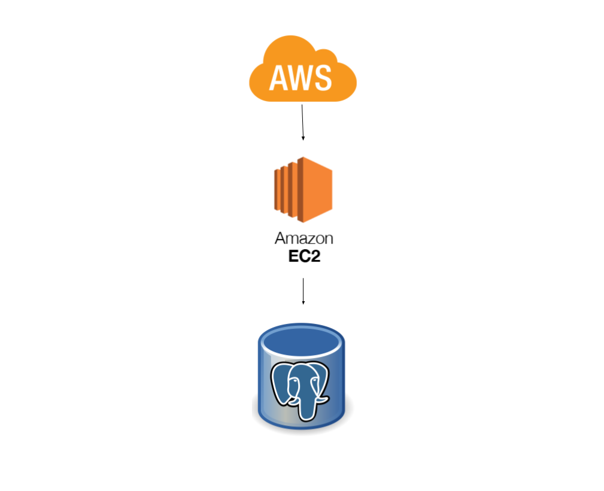

# Challenge CRUD

## About project

This project is a  books manager

## Local Deployment

For the service to work you must be running an instance of postgres, for that you can run this command:
```bash
docker run --name postgres -p 5432:5432 -e POSTGRES_USER=postgres -e POSTGRES_PASSWORD=postgres -e PGDATA=/var/lib/postgresql/data/pgdata  -v ./postgres:/var/lib/postgresql/data -d posgres```
```
Then you must create the database enter the postgres docker image and create the database with the following command:
```bash
docker exec -it postgres psql -U postgres
```
Create database
```SQL
CREATE DATABASE demo_db;
```
To upload the service you must run the following command from the directory of the project:
```bash
./gradlew bootRun
```
That will raise an HTTP service on port 8080, once it is up, you can run the following cURL:

```bash
curl --location --request GET 'localhost:8080/api/books'
```
You can find the complete postman collection in the folder called [postman](postman)

## cloud design


